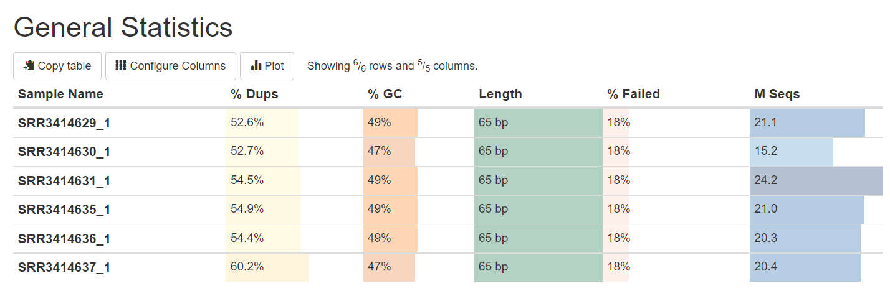
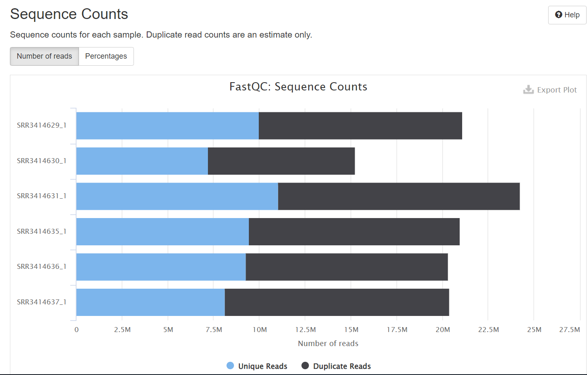
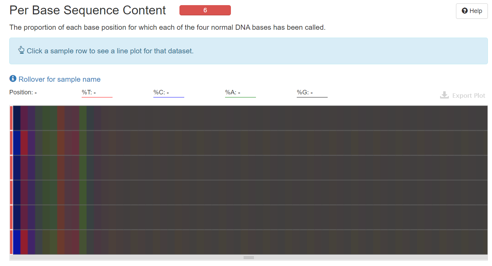
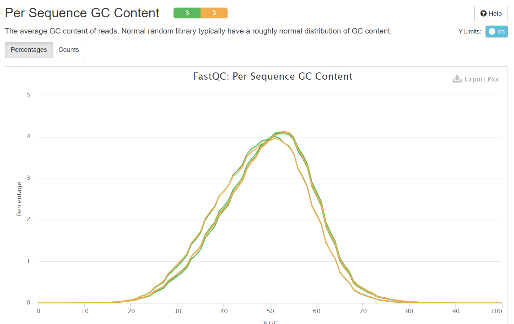
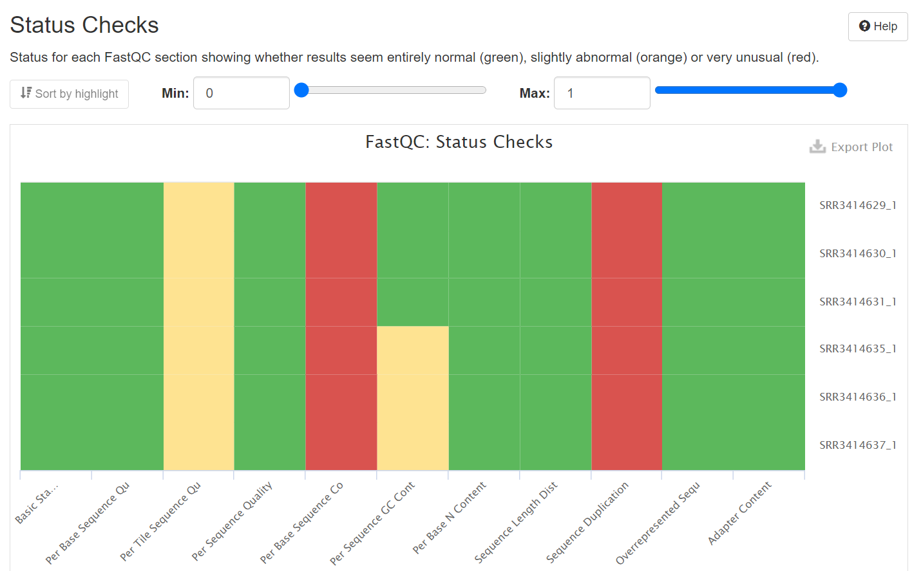
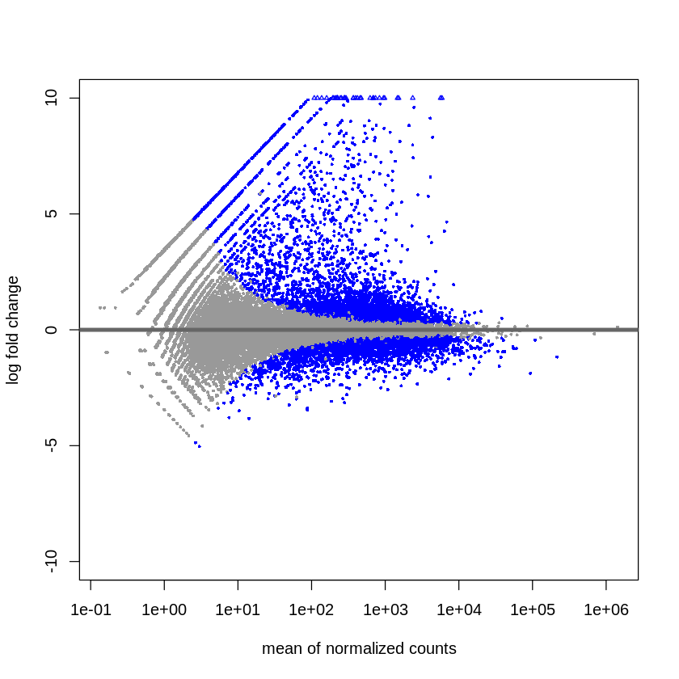
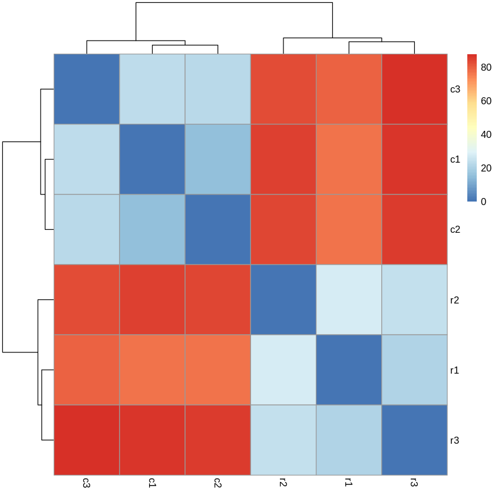
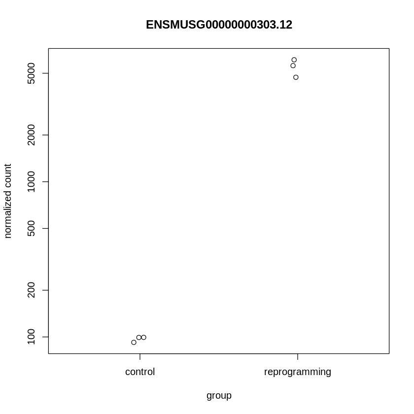
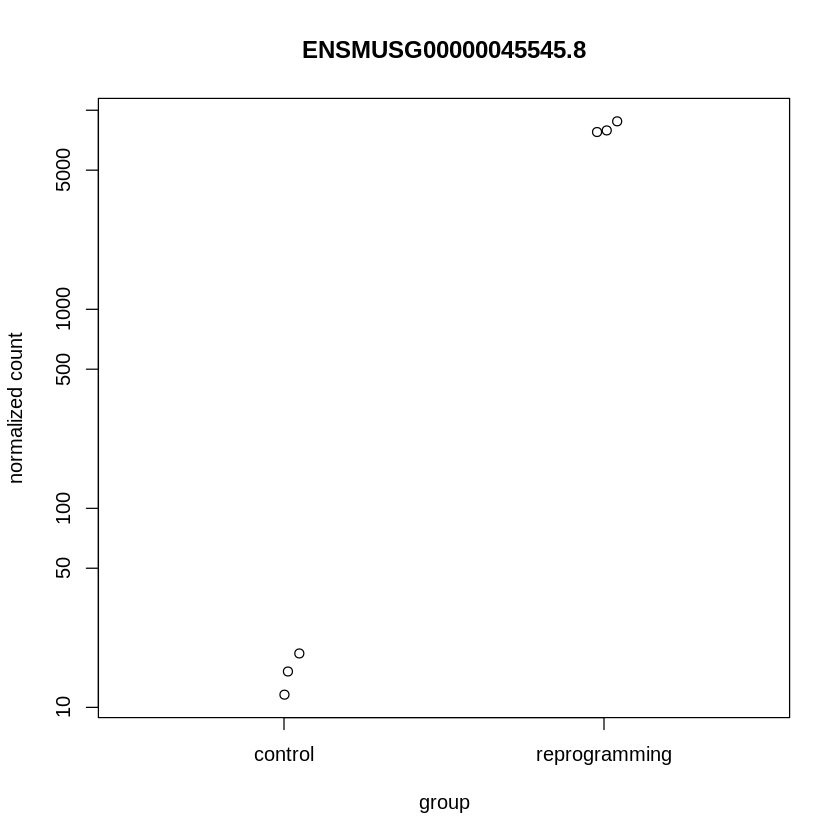

# Домашнее задание №3
###### Котся Борисов БПИ197

## Задание №1
Ссылка на Google colab на питоне: https://colab.research.google.com/drive/1AgM7ZicpqLw7BFv3oHwRmfi6SQhgM4Wo

### Отчёт multiQC
Ссылка: https://cortan122.github.io/hse21_hw3/multiqc_report.html

### Таблица
Sample ID | type | total reads | mapped reads | unique mapped reads | matchings |
 --- |--- |--- |--- |--- | ---
SRR3414629 | reprogramming | 21106089 | 20510113 | 18375888 | 16049609 |
SRR3414630 | reprogramming | 15244711 | 14832680 | 13186139 | 11465324 |
SRR3414631 | reprogramming | 24244069 | 23547686 | 20928945 | 18408851 |
SRR3414635 | control | 20956475 | 20395865 | 18428317 | 16275997 |
SRR3414636 | control | 20307147 | 19757059 | 17825380 | 15757580 |
SRR3414637 | control | 20385570 | 19847291 | 17844858 | 15736978 |

## Задание №2
Ссылка на Google colab на R: https://colab.research.google.com/drive/1gKciWqP6YvrAf6wnZmwyI4fJYriraYLP

### MA-plot

### Тепловая карта

### Самые важные гены

